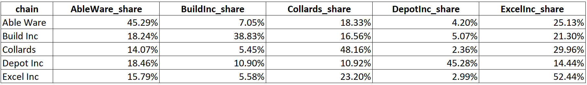

# Cross Shopping Analysis
## Objective
The overarching objective of this project is to develop a data product that allows for regular data updated to measure consumer shopping behavior.


This project is designed to have a technical backend that is able to effectively and efficiently manipulate data which can then be loaded into Excel to allow for less technically trained stakeholders to analyze the data further.

## Project Background
The company, Excel Inc. a home improvement store, has four competitors that it wants to compare itself to.  Excel Inc. hired a consultant to provide a large sample of mobile devices linked to individuals enabling them to obtain an individuals latitude and longitude.  The consultant is able to then provide a data set of consumers that contains visit information that links customers to the five home improvement stores in the area.

Using this data Excel Inc. wants to analyze the behavior of its customers so they can:
1. Better target their customers
2. Identify its biggest competitor
3. Identify its biggest competitor
4. Measure how loyal its customers are


## Tools Used
- SQL
- Excel

## Concepts Used
- Cross Shopping Analysis
- Geospacial Analysis

## Workflow
### Part 1: Create the Server
```sql
CREATE SERVER mobilevisits
FOREIGN DATA WRAPPER mysql
OPTIONS (USER 'gba424_student', HOST 'gba424.simon.rochester.edu', PASSWORD 'Student!2020', DATABASE 'mobilevisits');
```

### Part 2: Create the Database
```sql
DROP DATABASE IF EXISTS mobilevisits_fed;
CREATE DATABASE mobilevisits_fed;
USE mobilevisits_fed;
```
### Part 3: Create Federated and Local Tables
Each table will be built twice here, once as a federated table and once as a local table.  The reason this is a step that needs to be taken is because the federated table interacts with the server directly resulting in a load being placed on the hardware resources each time that table is used.  To get around this poblem, the tables will also be built locally.


The tables that are created here are stored in the federated database "mobilevisits" referenced in the OPTIONS argument in Part 1.  The below code will define these tables so they can be used later to build different tables and views.
#### Part 3.1: Create Chains Federated Table
```sql
DROP TABLE IF EXISTS chains_fed;
CREATE TABLE chains_fed(
	chain varchar(20) NOT NULL,
	PRIMARY KEY (`chain`)
)
ENGINE = FEDERATED
CONNECTION = 'mobilevisits/chains';
```

#### Part 3.2: Create Chains Local Table
```sql
DROP TABLE IF EXISTS chains_local;
CREATE TABLE chains_local
AS
SELECT * FROM mobilevisits_fed.chains_fed;
```
The tables built in Part 3.1 and 3.2 will yield the following structure:

#### Part 3.3: Create Users Federated Table
```sql
DROP TABLE IF EXISTS users_fed;
CREATE TABLE users_fed(
	userID INT NOT NULL,
	latitude DOUBLE NOT NULL,
	longitude DOUBLE NOT NULL,
	PRIMARY KEY (`userID`)
)
ENGINE = FEDERATED
CONNECTION = 'mobilevisits/users';
```
#### Part 3.4: Create Users Local Table
```sql
DROP TABLE IF EXISTS users_local;
CREATE TABLE users_local
AS
SELECT * FROM mobilevisits_fed.users_fed;
```
The tables built in Part 3.3 and 3.4 will yield the following structure:

#### Part 3.5: Create Venues Federated Table
```sql
DROP TABLE IF EXISTS venues_fed;
CREATE TABLE venues_fed(
	venueID INT NOT NULL,
	chain VARCHAR(20) NOT NULL,
	latitude DOUBLE NOT NULL,
	longitude DOUBLE NOT NULL,
	PRIMARY KEY (`venueID`)
)
ENGINE = FEDERATED
CONNECTION = 'mobilevisits/venues';
```
#### Part 3.6: Create Venues Local Table
```sql
DROP TABLE IF EXISTS venues_local;
CREATE TABLE venues_local
AS
SELECT * FROM mobilevisits_fed.venues_fed;
```
The tables built in Part 3.5 and 3.6 will yield the following structure:

#### Part 3.7: Create Visits Federated Table
```sql
DROP TABLE IF EXISTS visits_fed;
CREATE TABLE visits_fed(
	userID INT NOT NULL,
	venueID INT NOT NULL,
	PRIMARY KEY (`userID`, `venueID`)
)
ENGINE = FEDERATED
CONNECTION = 'mobilevisits/visits';
```
#### Part 3.8 Create Visits Local Table
```sql
DROP TABLE IF EXISTS visits_local;
CREATE TABLE visits_local
AS
SELECT * FROM mobilevisits_fed.visits_fed;
```
The tables built in Part 3.7 and 3.8 will yield the following structure:


### Part 4: Create Functions
CALC_DIST_MILES Function will be created to perform the analysis on how close the company's customers are located to it

```sql
DROP FUNCTION `CALC_DIST_MILES`;
DELIMITER ^^

CREATE FUNCTION `CALC_DIST_MILES`(
	lat_1 FLOAT, lon_1 FLOAT, lat_2 FLOAT, lon_2 FLOAT)
	RETURNS float
  NO SQL
  DETERMINISTIC

BEGIN
	RETURN 
		(6371 * 0.621371) * ACOS(
			COS(RADIANS(lat_1)) *
			COS(RADIANS(lat_2)) *
			COS(RADIANS(lon_2) - RADIANS(lon_1)) + 
			SIN(RADIANS(lat_1)) * SIN(RADIANS(lat_2))
                    );
END^^
DELIMITER ;
```
### Part 5: Create Views
A view is a virtual table defined by a query. It is similar to a table in that it contains a set of named columns and data in the rows. However, the data in a view is not stored in the database. This allows for flexibility in the structure of the view and allows users to access the data without requiring read and write permissions to the database, increasing security and minimizing the risk of data corruption or loss.

#### Part 5.1: Create the Data Warehouse View
This will contain the data that is needed for the analysis.  All of the tables will be directly or indirectly built off of this view.

Each row in this table will have a unique userID-chain combination containing the sum of the userID'S visits and distance to the corresponding chain.
```sql
DROP VIEW data_warehouse;
CREATE OR REPLACE VIEW data_warehouse AS
	SELECT dist.userID,
		dist.chain,
		frequency,
		CALC_DIST_MILES(lat_1, lon_1, lat_2, lon_2) AS distance
    FROM(SELECT vi.userID,
    		vi.venueID,
		chain,
		COUNT(vi.userID) AS frequency,
		u.latitude AS lat_1,
		u.longitude AS lon_1,
		ve.latitude AS lat_2,
		ve.longitude AS lon_2
	FROM visits_local vi
		LEFT JOIN users_local u
			ON vi.userID = u.userID
		LEFT JOIN venues_local ve
			ON vi.venueID = ve.venueID
		GROUP BY userID, venueID) as dist
ORDER BY dist.userID, chain
;
```
#### Part 5.2: Create the Customer Detail View
This will be used to build both the Overall Shopping Behaviors Table and the Cross Shopping Table.  This view uses the data from the data warehouse view.

This view is created by summing the total visits to each chain by each customer. 
```sql
DROP VIEW customer_detail;
CREATE OR REPLACE VIEW customer_detail AS
	SELECT userID,
		chain,
		SUM(AbleWare_visits) AS AbleWare_visits,
		SUM(BuildInc_visits) AS BuildInc_visits,
		SUM(Collards_visits) AS Collards_visits,
		SUM(DepotInc_visits) AS DepotInc_visits,
		SUM(ExcelInc_visits) AS ExcelInc_visits
    	FROM (SELECT chain,
			userID,
			CASE WHEN chain = 'AbleWare' THEN frequency ELSE 0 END AS AbleWare_visits,
			CASE WHEN chain = 'BuildInc' THEN frequency ELSE 0 END AS BuildInc_visits,
			CASE WHEN chain = 'Collards' THEN frequency ELSE 0 END AS Collards_visits,
			CASE WHEN chain = 'DepotInc' THEN frequency ELSE 0 END AS DepotInc_visits,
			CASE WHEN chain = 'ExcelInc' THEN frequency ELSE 0 END AS ExcelInc_visits
	FROM data_warehouse dw) AS fr
GROUP BY userID;
```
### Part 6: Creating the Calculated Tables
Now that the general views have been created, the analysis of the data can commence.

#### Part 6.1: Create Overall Shopping Behaviors Table
##### Part 6.1.1 Create the chain_frequency View

This view will calculate the visit and customer counts for the Overall Shopping Behavior Table
```sql
DROP VIEW chain_frequency;
CREATE OR REPLACE VIEW chain_frequency AS
SELECT chain,
	visits,
	customer
FROM(SELECT chain,
	SUM(frequency) AS visits,
	COUNT(DISTINCT(userID)) AS customer
	FROM data_warehouse
	GROUP BY chain) AS f;
```
This code will create a table containing the following information:


<!-- -->

##### Part 6.1.2: Create the customer_detail_loyal View
This view will calculate the customer loyalty numbers for the Overall Shopping Behavior Table
```sql
DROP VIEW customer_detail_loyal;
CREATE OR REPLACE VIEW customer_detail_loyal AS
SELECT chain,
	SUM(loyal) AS loyal_customers
FROM(SELECT chain,
	userID,
	CASE 
		WHEN AbleWare_visits > 0 AND BuildInc_visits = 0 AND Collards_visits = 0 AND DepotInc_visits = 0 AND ExcelInc_visits = 0 THEN 1
		WHEN BuildInc_visits > 0 AND AbleWare_visits = 0 AND Collards_visits = 0 AND DepotInc_visits = 0 AND ExcelInc_visits = 0 THEN 1
		WHEN Collards_visits > 0 AND AbleWare_visits = 0 AND BuildInc_visits = 0 AND DepotInc_visits = 0 AND ExcelInc_visits = 0 THEN 1
		WHEN DepotInc_visits > 0 AND AbleWare_visits = 0 AND BuildInc_visits = 0 AND Collards_visits = 0 AND ExcelInc_visits = 0 THEN 1
		WHEN ExcelInc_visits > 0 AND AbleWare_visits = 0 AND BuildInc_visits = 0 AND Collards_visits = 0 AND DepotInc_visits = 0 THEN 1 ELSE 0 END AS loyal
	FROM(SELECT * FROM customer_detail) AS detail
	) AS loyal
GROUP BY chain;
```
This code will create a table containing the following information:

<!-- -->

##### Part 6.1.3: Create overall_shopping_behavior View
-- Creates the overall_shopping_behavior view which is the Overall Shopping Behaviors Table
```sql
DROP VIEW overall_shopping_behavior;
CREATE OR REPLACE VIEW overall_shopping_behavior AS
SELECT cf.chain,
	visits / (SELECT SUM(visits) FROM chain_frequency) AS visit_share,
        customer / (SELECT COUNT(DISTINCT(userID)) FROM customer_detail) AS customer_share,
        loyal_customers / customer AS loyal_customer_percent,
        loyal_customers / (SELECT SUM(loyal_customers) FROM customer_detail_loyal) AS loyal_share,
        customer AS total_customers,
        visits AS total_visits
FROM chain_frequency cf
	JOIN customer_detail_loyal cdf
		ON cf.chain = cdf.chain
ORDER BY chain;
SELECT COUNT(DISTINCT(userID)) FROM customer_detail;
```
This code will create a table containing the following information:

<!-- -->

#### Part 6.2: Create Cross Shopping Table
##### Part 6.2.1: Create cross_shopping_cust View
This view will be used to which is used to make the cross shopping tabe.  This view will organize the data to be further manipulated in another view.
```sql
DROP VIEW cross_shopping_cust;
CREATE OR REPLACE VIEW cross_shopping_cust AS
SELECT userID,
	chain
FROM data_warehouse
GROUP BY userID, chain
ORDER BY userID;
```
This code will create a table containing the following information:

<!-- -->

##### Part 6.2.2: Create cross_shopping View
This will create a table that contains the share of customers that each chain has.  The data in this view is derived from the cross_shopping_cust view and customer_detail view
```sql
DROP VIEW cross_shopping;
CREATE OR REPLACE VIEW cross_shopping AS
SELECT csc.chain,
        SUM(AbleWare_visits) / (SUM(AbleWare_visits + BuildInc_visits + Collards_visits + DepotInc_visits + ExcelInc_visits)) AS AbleWare_share,
        SUM(BuildInc_visits) / (SUM(AbleWare_visits + BuildInc_visits + Collards_visits + DepotInc_visits + ExcelInc_visits)) AS BuildInc_share,
        SUM(Collards_visits) / (SUM(AbleWare_visits + BuildInc_visits + Collards_visits + DepotInc_visits + ExcelInc_visits)) AS Collards_share,
        SUM(DepotInc_visits) / (SUM(AbleWare_visits + BuildInc_visits + Collards_visits + DepotInc_visits + ExcelInc_visits)) AS DepotInc_share,
        SUM(ExcelInc_visits) / (SUM(AbleWare_visits + BuildInc_visits + Collards_visits + DepotInc_visits + ExcelInc_visits)) AS ExcelInc_share
FROM cross_shopping_cust csc
LEFT JOIN customer_detail cd
ON csc.userID = cd.userID
GROUP BY chain
ORDER BY chain;
```
This code will create a table containing the following information:

<!-- -->

#### Part 6.3: Create Segmentation Tables
##### Part 6.3.1: Identify the Loyal Customers
This view will identify the customers who are defined as being loyal.  Loyal will be defined as the customer only shops at that chain.
```sql
CREATE OR REPLACE VIEW customer_detail_loyal_cust AS
SELECT userID,
	chain,
	SUM(loyal) AS loyal_customer
FROM(SELECT chain,
	userID,
	CASE 
		WHEN AbleWare_visits > 0 AND BuildInc_visits = 0 AND Collards_visits = 0 AND DepotInc_visits = 0 AND ExcelInc_visits = 0 THEN 1
		WHEN BuildInc_visits > 0 AND AbleWare_visits = 0 AND Collards_visits = 0 AND DepotInc_visits = 0 AND ExcelInc_visits = 0 THEN 1
		WHEN Collards_visits > 0 AND AbleWare_visits = 0 AND BuildInc_visits = 0 AND DepotInc_visits = 0 AND ExcelInc_visits = 0 THEN 1
		WHEN DepotInc_visits > 0 AND AbleWare_visits = 0 AND BuildInc_visits = 0 AND Collards_visits = 0 AND ExcelInc_visits = 0 THEN 1
		WHEN ExcelInc_visits > 0 AND AbleWare_visits = 0 AND BuildInc_visits = 0 AND Collards_visits = 0 AND DepotInc_visits = 0 THEN 1 ELSE 0 END AS loyal
	FROM(SELECT * FROM customer_detail) AS detail
	) AS loyal
GROUP BY userID;
```
This code will create a table containing the following information:

<!-- -->

##### Part 6.3.2: Calculate the Proportional Share of Customers who are Defined as Being Loyal for Each Chain
```sql
CREATE OR REPLACE VIEW 3ci_segmentation_loyal_cust AS
SELECT chain,
       SUM(CASE WHEN loyal = 1 THEN 1 ELSE 0 END) / COUNT(loyal) AS loyal,
       SUM(CASE WHEN loyal = 0 THEN 1 ELSE 0 END) / COUNT(loyal) AS non_loyal
FROM(SELECT dw.userID,
		dw.chain,
		CASE
			WHEN AbleWare_visits > 0 AND BuildInc_visits = 0 AND Collards_visits = 0 AND DepotInc_visits = 0 AND ExcelInc_visits = 0 THEN 1
			WHEN BuildInc_visits > 0 AND AbleWare_visits = 0 AND Collards_visits = 0 AND DepotInc_visits = 0 AND ExcelInc_visits = 0 THEN 1
			WHEN Collards_visits > 0 AND AbleWare_visits = 0 AND BuildInc_visits = 0 AND DepotInc_visits = 0 AND ExcelInc_visits = 0 THEN 1
			WHEN DepotInc_visits > 0 AND AbleWare_visits = 0 AND BuildInc_visits = 0 AND Collards_visits = 0 AND ExcelInc_visits = 0 THEN 1
			WHEN ExcelInc_visits > 0 AND AbleWare_visits = 0 AND BuildInc_visits = 0 AND Collards_visits = 0 AND DepotInc_visits = 0 THEN 1 ELSE 0 END AS loyal
	FROM data_warehouse dw
		JOIN customer_detail cd
			ON dw.userID = cd.userID
	GROUP BY userID, chain
	ORDER BY userID) AS L
    GROUP BY chain
    ORDER BY chain;
```
This code will create a table containing the following information:

<!-- -->

##### Part 6.3.3: Calculate the Proportion of Customers at Each Chain who are Defined as Loyal for Each Chain
```sql
CREATE OR REPLACE VIEW 3cii_segmentation_loyal_trip AS
SELECT chain,
       SUM(loyal) / SUM(loyal + non_loyal) AS loyal,
       SUM(non_loyal) / SUM(loyal + non_loyal) AS non_loyal
FROM(SELECT dw.userID,
		dw.chain,
		CASE
			WHEN AbleWare_visits > 0 AND BuildInc_visits = 0 AND Collards_visits = 0 AND DepotInc_visits = 0 AND ExcelInc_visits = 0 THEN 1 * frequency
			WHEN BuildInc_visits > 0 AND AbleWare_visits = 0 AND Collards_visits = 0 AND DepotInc_visits = 0 AND ExcelInc_visits = 0 THEN 1 * frequency
			WHEN Collards_visits > 0 AND AbleWare_visits = 0 AND BuildInc_visits = 0 AND DepotInc_visits = 0 AND ExcelInc_visits = 0 THEN 1 * frequency
			WHEN DepotInc_visits > 0 AND AbleWare_visits = 0 AND BuildInc_visits = 0 AND Collards_visits = 0 AND ExcelInc_visits = 0 THEN 1 * frequency
			WHEN ExcelInc_visits > 0 AND AbleWare_visits = 0 AND BuildInc_visits = 0 AND Collards_visits = 0 AND DepotInc_visits = 0 THEN 1 * frequency ELSE 0 END AS loyal,
		CASE
			WHEN AbleWare_visits > 0 AND (BuildInc_visits > 0 OR Collards_visits > 0 OR DepotInc_visits > 0 OR ExcelInc_visits > 0) THEN 1 * frequency
			WHEN BuildInc_visits > 0 AND (AbleWare_visits > 0 OR Collards_visits > 0 OR DepotInc_visits > 0 OR ExcelInc_visits > 0) THEN 1 * frequency
			WHEN Collards_visits > 0 AND (AbleWare_visits > 0 OR BuildInc_visits > 0 OR DepotInc_visits > 0 OR ExcelInc_visits > 0) THEN 1 * frequency
			WHEN DepotInc_visits > 0 AND (AbleWare_visits > 0 OR BuildInc_visits > 0 OR Collards_visits > 0 OR ExcelInc_visits > 0) THEN 1 * frequency
			WHEN ExcelInc_visits > 0 AND (AbleWare_visits > 0 OR BuildInc_visits > 0 OR Collards_visits > 0 OR DepotInc_visits > 0) THEN 1 * frequency ELSE 0 END AS non_loyal
	FROM data_warehouse dw
		JOIN customer_detail cd
			ON dw.userID = cd.userID
	GROUP BY userID, chain
	ORDER BY userID) AS L
    GROUP BY chain
    ORDER BY chain;
```
This code will create a table containing the following information:

<!-- -->

##### Part 6.3.4: Calculate Proportion of Frequent Customers at Each Chain
```sql
CREATE OR REPLACE VIEW 3aii_segmentation_frequent_trip AS
SELECT chain, 
	sum(frequent) / SUM(frequent + nonfrequent) AS frequent,
	sum(nonfrequent) / SUM(frequent + nonfrequent) AS nonfrequent
FROM (SELECT userid, 
	chain, 
	sum(frequency) AS frequency,
	CASE WHEN SUM(frequency) > 2 THEN 1 * frequency ELSE 0 END AS frequent,
	CASE WHEN SUM(frequency) <= 2 THEN 1 * frequency ELSE 0 END AS nonfrequent
FROM data_warehouse
GROUP BY userID, chain) AS I
GROUP BY chain
ORDER BY chain;
```
This code will create a table containing the following information:

<!-- -->

##### Part 6.3.5: Identify the Customers Defined as Close for Each Chain
Close means that the customer lives less than 5 miles away from the venue
```sql
CREATE OR REPLACE VIEW 3bi_segmentation_distance_cust AS
SELECT chain, 
	sum(far) / COUNT(DISTINCT(userID)) AS far, 
        sum(close) / COUNT(DISTINCT(userID)) AS close
FROM(SELECT userid,
		chain,
		SUM(frequency) AS frequency,
		distance,
		CASE WHEN distance >= 5 THEN COUNT(DISTINCT(userID)) ELSE 0 END AS far,
		CASE WHEN distance < 5 THEN COUNT(DISTINCT(userID)) ELSE 0 END AS close
	FROM data_warehouse
    GROUP BY userid, chain) AS UF
GROUP BY chain
ORDER BY chain;
```
This code will create a table containing the following information:

<!-- -->

##### Part 6.3.6: Calculate the Proportion of Customers who are Defined as Being Close for Each Chain
```sql
CREATE OR REPLACE VIEW 3bii_segmentation_distance_trip AS
SELECT chain, 
	sum(far) / SUM(close + far) AS far, 
        sum(close) / SUM(close + far) AS close
FROM(SELECT userid,
		chain,
		SUM(frequency) AS frequency,
		distance,
		CASE WHEN distance >= 5 THEN SUM(frequency) ELSE 0 END AS far,
		CASE WHEN distance < 5 THEN SUM(frequency) ELSE 0 END AS close
	FROM data_warehouse
    GROUP BY userid, chain) AS UF
GROUP BY chain
ORDER BY chain;
```
This code will create a table containing the following information:

<!-- -->

##### Part 6.3.7: Identify Customers Defined as Frequent
Frequent means that the customer has visited the chain more than 2 times in the past year.

This is different from the next table (Part 6.3.3) as it will simply flag the frequent customers where as the next table will calculate the percent of customers at a given chain that are frequent.
```sql
CREATE OR REPLACE VIEW 3ai_segmentation_frequent_cust AS
SELECT chain, 
	sum(frequent) / COUNT(DISTINCT(userID)) AS frequent,
	sum(nonfrequent) / COUNT(DISTINCT(userID)) AS nonfrequent
FROM (SELECT userid, 
	chain, 
	sum(frequency) AS frequency,
	CASE WHEN SUM(frequency) > 2 THEN 1 ELSE 0 END AS frequent,
	CASE WHEN SUM(frequency) <= 2 THEN 1 ELSE 0 END AS nonfrequent
FROM data_warehouse
GROUP BY userID, chain) AS I
GROUP BY chain
ORDER BY chain;
```
This code will create a table containing the following information:

<!-- -->

##### Part 6.3.8: Identify the Frequent and Loyal Customers at Each Chain
Here the date_warehouse and customer_detail_loyal_cust views will be joined together to form the desired output.
```sql
CREATE OR REPLACE VIEW 3aiii_segmentation_frequent_loyal AS
SELECT chain, 
	SUM(CASE WHEN loyal_customer = 1 THEN frequent ELSE 0 END) / COUNT(DISTINCT(userID)) AS frequent_loyal,
	SUM(CASE WHEN loyal_customer = 1 THEN nonfrequent ELSE 0 END) / COUNT(DISTINCT(userID)) AS nonfrequent_loyal,
	SUM(CASE WHEN loyal_customer = 0 THEN frequent ELSE 0 END) / COUNT(DISTINCT(userID)) AS frequent_nonloyal,
	SUM(CASE WHEN loyal_customer = 0 THEN nonfrequent ELSE 0 END) / COUNT(DISTINCT(userID)) AS nonfrequent_nonloyal
FROM (SELECT dw.userid, 
		dw.chain, 
		sum(frequency) AS frequency,
		CASE WHEN SUM(frequency) > 2 THEN 1 ELSE 0 END AS frequent,
		CASE WHEN SUM(frequency) <= 2 THEN 1 ELSE 0 END AS nonfrequent,
		loyal_customer
FROM data_warehouse dw
LEFT JOIN customer_detail_loyal_cust cdlc
	ON dw.userID = cdlc.userID
GROUP BY dw.userID, dw.chain) AS I
GROUP BY chain
ORDER BY chain;
```
This code will create a table containing the following information:

<!-- -->

##### Part 6.3.9: Calculate the Proportion of Customers at Each Chain who are Defined as Loyal and frequent for Each Chain
```sql
CREATE OR REPLACE VIEW 3d_segmentation_loyal_frequent AS
SELECT	chain,
        SUM(AbleWare_visits) / (SUM(AbleWare_visits + BuildInc_visits + Collards_visits + DepotInc_visits + ExcelInc_visits)) AS AbleWare_share,
        SUM(BuildInc_visits) / (SUM(AbleWare_visits + BuildInc_visits + Collards_visits + DepotInc_visits + ExcelInc_visits)) AS BuildInc_share,
        SUM(Collards_visits) / (SUM(AbleWare_visits + BuildInc_visits + Collards_visits + DepotInc_visits + ExcelInc_visits)) AS Collards_share,
        SUM(DepotInc_visits) / (SUM(AbleWare_visits + BuildInc_visits + Collards_visits + DepotInc_visits + ExcelInc_visits)) AS DepotInc_share,
        SUM(ExcelInc_visits) / (SUM(AbleWare_visits + BuildInc_visits + Collards_visits + DepotInc_visits + ExcelInc_visits)) AS ExcelInc_share
FROM(SELECT userID,
		chain,
		CASE WHEN loyal = 0 AND frequent = 1 THEN AbleWare_visits ELSE 0 END AS AbleWare_visits,
		CASE WHEN loyal = 0 AND frequent = 1 THEN BuildInc_visits ELSE 0 END AS BuildInc_visits,
		CASE WHEN loyal = 0 AND frequent = 1 THEN Collards_visits ELSE 0 END AS Collards_visits,
		CASE WHEN loyal = 0 AND frequent = 1 THEN DepotInc_visits ELSE 0 END AS DepotInc_visits,
		CASE WHEN loyal = 0 AND frequent = 1 THEN ExcelInc_visits ELSE 0 END AS ExcelInc_visits
FROM(SELECT dw.userID,
		dw.chain,
		SUM(dw.frequency) AS frequency,
		CASE 
			WHEN AbleWare_visits > 0 AND BuildInc_visits = 0 AND Collards_visits = 0 AND DepotInc_visits = 0 AND ExcelInc_visits = 0 THEN 1
			WHEN BuildInc_visits > 0 AND AbleWare_visits = 0 AND Collards_visits = 0 AND DepotInc_visits = 0 AND ExcelInc_visits = 0 THEN 1
			WHEN Collards_visits > 0 AND AbleWare_visits = 0 AND BuildInc_visits = 0 AND DepotInc_visits = 0 AND ExcelInc_visits = 0 THEN 1
			WHEN DepotInc_visits > 0 AND AbleWare_visits = 0 AND BuildInc_visits = 0 AND Collards_visits = 0 AND ExcelInc_visits = 0 THEN 1
			WHEN ExcelInc_visits > 0 AND AbleWare_visits = 0 AND BuildInc_visits = 0 AND Collards_visits = 0 AND DepotInc_visits = 0 THEN 1 ELSE 0 END AS loyal,
		CASE WHEN SUM(frequency) > 2 THEN 1 ELSE 0 END AS frequent,
		AbleWare_visits,
		BuildInc_visits,
		Collards_visits,
		DepotInc_visits,
		ExcelInc_visits
	FROM data_warehouse dw
		LEFT JOIN customer_detail cd
			ON dw.userID = cd.userID
	GROUP BY userID, chain
	ORDER BY userID) as LF
    GROUP BY userID, chain) AS p
    GROUP BY chain
    ORDER BY chain;
```
This code will create a table containing the following information:

<!-- -->

##### Part 6.3.10: Calculate the Proportion of Customers who are Defined as Being Close and Loyal for Each Chain
```sql
CREATE OR REPLACE VIEW 3biii_segmentation_distance_cust_loyal AS
SELECT chain, 
       SUM(CASE WHEN loyal_customer = 1 THEN far ELSE 0 END) / COUNT(DISTINCT(userID)) AS far_loyal,
       SUM(CASE WHEN loyal_customer = 1 THEN close ELSE 0 END) / COUNT(DISTINCT(userID)) AS close_loyal,
       SUM(CASE WHEN loyal_customer = 0 THEN far ELSE 0 END) / COUNT(DISTINCT(userID)) AS far_nonloyal,
       SUM(CASE WHEN loyal_customer = 0 THEN close ELSE 0 END) / COUNT(DISTINCT(userID)) AS close_nonloyal       
FROM(SELECT dw.userid,
		dw.chain,
		SUM(frequency) AS frequency,
		distance,
		CASE WHEN distance >= 5 THEN COUNT(DISTINCT(dw.userID)) ELSE 0 END AS far,
		CASE WHEN distance < 5 THEN COUNT(DISTINCT(dw.userID)) ELSE 0 END AS close,
		loyal_customer
	FROM data_warehouse dw
		LEFT JOIN customer_detail_loyal_cust cdlc
	ON dw.userID = cdlc.userID
    GROUP BY dw.userid, dw.chain) AS UF
GROUP BY chain
ORDER BY chain;
```
This code will create a table containing the following information:

<!-- -->
