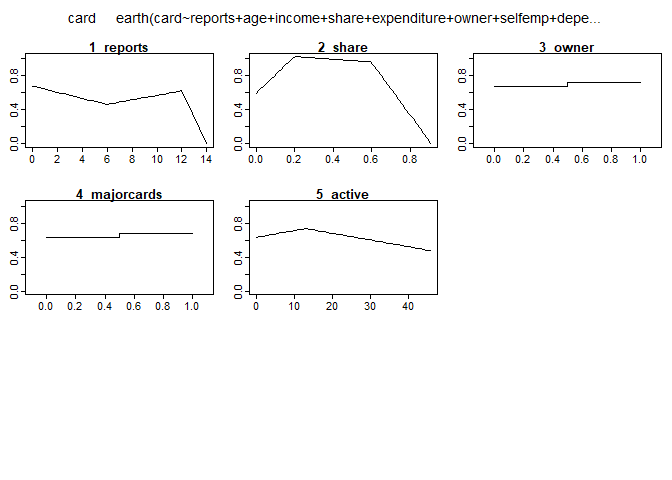
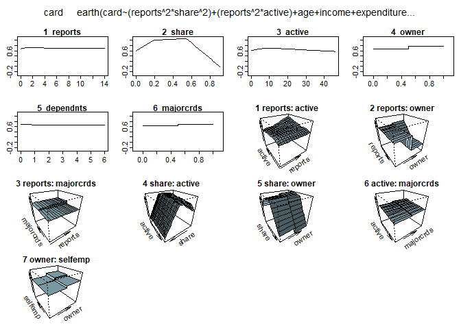
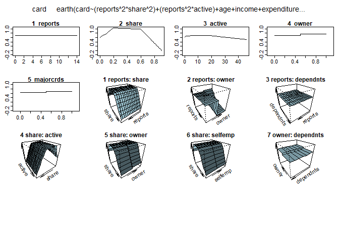

Predictive Model Training and Testing
================
Maximilian Johnson
10 January, 2023


## Objective

The objective of this project is to train a model and then test the
model’s ability to make predictions. The model will be trained using
both linear and nonlinear regression techniques, and the predictions
made by the model will be compared to the actual values in the testing
set to evaluate the model’s performance.

## Tools Used

- R
- R Markdown

## Concepts Used

 - [Linear Regression](https://github.com/mj8295/Data_Projects/blob/74cdfa2d9156c8995cc85ca41cb64ce991034a9f/Concepts/Linear_Regression.md)
 - [MARS](https://github.com/mj8295/Data_Projects/blob/74cdfa2d9156c8995cc85ca41cb64ce991034a9f/Concepts/MARS.md)
 - [K-Fold Cross-Validation](https://github.com/mj8295/Data_Projects/blob/74cdfa2d9156c8995cc85ca41cb64ce991034a9f/Concepts/K-Fold_Cross_Validation.md)


## Workflow

### Part 1: Load data, libraries, and define functions for later use

``` r
rm(list = ls())
setwd('C:/Users/Max/Documents/MSBA/MSBA Fall B/MKT 436R/Assignment 3')
df <- read.csv('Student Data 5.csv')
```

Load packages

``` r
library(earth)
```

    ## Warning: package 'earth' was built under R version 4.0.3

    ## Loading required package: Formula

    ## Warning: package 'Formula' was built under R version 4.0.3

    ## Loading required package: plotmo

    ## Warning: package 'plotmo' was built under R version 4.0.3

    ## Loading required package: plotrix

    ## Warning: package 'plotrix' was built under R version 4.0.3

    ## Loading required package: TeachingDemos

    ## Warning: package 'TeachingDemos' was built under R version 4.0.3

Preserve raw data and rename table to an intuitive name

``` r
approval_data <- data.frame(df)
```

Create training data set, made up of a random 80% of the total data set,
and validation data set using the remaining data

``` r
set.seed(3161)

is_training <- runif(nrow(approval_data)) < .8
training_data <- subset(approval_data, is_training)

validation_data <- subset(approval_data, !is_training)
```

Create RMSE Function to evaluate the accuracy of the model

``` r
get_detail_RMSE <- function(model){
  actualY <- validation_data$card
  predictedY <- predict(model, validation_data)
  return(mean((actualY - predictedY)^2)^.5)
}
```

### Part 2: Creating the first predictive model

#### Part 2a: Preliminary Investigation

Run a MARS model so the plotmo function can be used to get more
information to assist in the creation of models

``` r
earth1 <- earth(card ~ reports + age + income + share + expenditure + owner + selfemp + dependents + months + majorcards + active, data = training_data)
plotmo(earth1)
```

    ##  plotmo grid:    reports   age income      share expenditure owner selfemp
    ##                        0 31.25    2.9 0.03867167    100.4167     0       0
    ##  dependents months majorcards active
    ##           0     30          1      6

<!-- -->

The plotmo function indicates that share and reports appear to be
parabolic. These parameters will be squared in the first regression
model to account for this relationship

``` r
model1.1 <- lm(card ~ reports^2 + age + income + share^2 + expenditure + owner + selfemp + dependents + months + majorcards + active, data = training_data)
get_detail_RMSE(model1.1)
```

    ## [1] 0.4335845

#### Part 2b: Refining the model using linear regression

Add an interaction between the non-linear terms seen in the plotmo of
earth1 from step 2

``` r
model1.2 <- lm(card ~ (reports^2 * share^2) + age + income + expenditure + owner + selfemp + dependents + months + majorcards + share^2 + active, data = training_data)
model1.3 <- lm(card ~ (reports^2 * share^2) + age + income + expenditure + owner + selfemp + dependents + months + majorcards + (share^2 * active), data = training_data)
model1.4 <- lm(card ~ (reports^2 * share^2) + (reports^2 * active) + age + income + expenditure + owner + selfemp + dependents + months + majorcards + (share^2 * active), data = training_data)

get_detail_RMSE(model1.2)
```

    ## [1] 0.4336099

``` r
get_detail_RMSE(model1.3)
```

    ## [1] 0.433298

``` r
get_detail_RMSE(model1.4)
```

    ## [1] 0.4331584

The accuracy of adding these terms improves the predictive capabilities
of the model so they will be kept in future models \#### Part 2c:
Refining the model using the MARS model

``` r
# Now lets begin using the MARS modelon our best regression so far (model1B.4)
model1.5 <- earth(card ~ (reports^2 * share^2) + (reports^2 * active) + age + income + expenditure + owner + selfemp + dependents + months + majorcards + (share^2 * active), data = training_data)
get_detail_RMSE(model1.5)
```

    ## [1] 0.4215599

Implementing the MARS model increases the performance of the modelso
this will be kept in future models.

#### Part 2d: Refining the model by applying the degree argument

``` r
model1.6 <- earth(card ~ (reports^2 * share^2) + (reports^2 * active) + age + income + expenditure + owner + selfemp + dependents + months + majorcards + (share^2 * active), degree = 2, data = training_data)
get_detail_RMSE(model1.6)
```

    ## [1] 0.4186262

The degree term improves performance so this will be kept in future
models.

#### Part 2e: Refining the model by tweaking the thresh term

``` r
model1.7 <- earth(card ~ (reports^2 * share^2) + (reports^2 * active) + age + income + expenditure + owner + selfemp + dependents + months + majorcards + (share^2 * active), degree = 2, thresh = 0, data = training_data)
model1.8 <- earth(card ~ (reports^2 * share^2) + (reports^2 * active) + age + income + expenditure + owner + selfemp + dependents + months + majorcards + (share^2 * active), degree = 2, thresh = 0.1, data = training_data)
model1.9 <- earth(card ~ (reports^2 * share^2) + (reports^2 * active) + age + income + expenditure + owner + selfemp + dependents + months + majorcards + (share^2 * active), degree = 2, thresh = 0.01, data = training_data)

get_detail_RMSE(model1.7)
```

    ## [1] 0.4181611

``` r
get_detail_RMSE(model1.8)
```

    ## [1] 0.4268396

``` r
get_detail_RMSE(model1.9)
```

    ## [1] 0.4268396

Thresh being equl to 0 and degree being equal to 2 yields the best
results so model1.7 will be built upon moving forward \#### Part 2f:
Visualize each parameter’s relationship to card to further refine model
Visualize model1.7 to identify any other potential interactions

``` r
plotmo(model1.7)
```

    ##  plotmo grid:    reports      share active   age income expenditure owner
    ##                        0 0.03867167      6 31.25    2.9    100.4167     0
    ##  selfemp dependents months majorcards
    ##        0          0     30          1

<!-- -->
Additional interactions can be seen which will be added to the next
model iteration.

``` r
model1.10 <- earth(card ~ (reports^2 * share^2) + (reports^2 * active) + age + income + expenditure + (reports^2 * owner) + (owner * share^2) + (selfemp * owner) + dependents + months + majorcards + (share^2 * active), degree = 2, thresh = 0, data = training_data)
get_detail_RMSE(model1.10)
```

    ## [1] 0.417578

``` r
plotmo(model1.10)
```

    ##  plotmo grid:    reports      share active   age income expenditure owner
    ##                        0 0.03867167      6 31.25    2.9    100.4167     0
    ##  selfemp dependents months majorcards
    ##        0          0     30          1

<!-- --> The
visualization of model1.10 indicates that there are additional
interactions that can be tested out in a new model

``` r
model1.11 <- earth(card ~ (reports^2 * share^2) + (reports^2 * active) + age + income + expenditure + (reports^2 * owner) + (owner * share^2) + (selfemp * owner) + (reports^2 * dependents) + (owner * dependents) + months + (majorcards * owner) + (majorcards * selfemp) + (share^2 * active), degree = 2, thresh = 0, data = training_data)
get_detail_RMSE(model1.11)
```

    ## [1] 0.4175174

Adding these interactions improved the model’s performance so they will
be kept.

Try adding factor terms to owner, selfemp, and majorcard to see if this
improves performance further.

``` r
model1.12 <- earth(card ~ (reports^2 * share^2) + (reports^2 * active) + age + income + expenditure + (reports^2 * factor(owner)) + (factor(owner) * share^2) + (factor(selfemp) * factor(owner)) + dependents + months + factor(majorcards) + (share^2 * active), degree = 2, thresh = 0, data = training_data)

get_detail_RMSE(model1.12)
```

    ## [1] 0.417578

This didnt help so again model1.11 will continue to be used moving
forward.

The last step is to try deleting terms one by one to see if that
increases the model’s performance

``` r
model1.13 <- earth(card ~ (reports^2 * share^2) + (reports^2 * active) + income + expenditure + (reports^2 * owner) + (owner * share^2) + (selfemp * owner) + dependents + months + majorcards + (share^2 * active), degree = 2, thresh = 0, data = training_data)
model1.14 <- earth(card ~ (reports^2 * share^2) + (reports^2 * active) + age + expenditure + (reports^2 * owner) + (owner * share^2) + (selfemp * owner) + dependents + months + majorcards + (share^2 * active), degree = 2, thresh = 0, data = training_data)
model1.15 <- earth(card ~ (reports^2 * share^2) + (reports^2 * active) + age + income + (reports^2 * owner) + (owner * share^2) + (selfemp * owner) + dependents + months + majorcards + (share^2 * active), degree = 2, thresh = 0, data = training_data)
model1.16 <- earth(card ~ (reports^2 * share^2) + (reports^2 * active) + age + income + expenditure + (reports^2 * owner) + (owner * share^2) + (selfemp * owner) + months + majorcards + (share^2 * active), degree = 2, thresh = 0, data = training_data)
model1.17 <- earth(card ~ (reports^2 * share^2) + (reports^2 * active) + age + income + expenditure + (reports^2 * owner) + (owner * share^2) + (selfemp * owner) + dependents + majorcards + (share^2 * active), degree = 2, thresh = 0, data = training_data)

get_detail_RMSE(model1.13)
```

    ## [1] 0.4176734

``` r
get_detail_RMSE(model1.14)
```

    ## [1] 0.4176734

``` r
get_detail_RMSE(model1.15)
```

    ## [1] 0.4176734

``` r
get_detail_RMSE(model1.16)
```

    ## [1] 0.4179351

``` r
get_detail_RMSE(model1.17)
```

    ## [1] 0.4176734

Model 15 did better here so now expense will be dropped and poly will be
added to age to see if any improvement can be yielded.

``` r
model1.18 <- earth(card ~ (reports^2 * share^2) + (reports^2 * active) + poly(age,3) + income + (reports^2 * owner) + (owner * share^2) + (selfemp * owner) + dependents + months + majorcards + (share^2 * active), degree = 2, thresh = 0, data = training_data)
get_detail_RMSE(model1.18)
```

    ## [1] 0.4175157

The improvement here was very small so model1.18 the final model

### Part 3: Validating the model

K-fold cross validation will be used on the best models to double check
and make sure model1.18 is the best. There are several models with near
identical RMSE scores so those ones should be tested as well

``` r
nFold = 5
model_performance <- matrix(NA, nFold, 3)

for(fold in 1:nFold){
  val_num <- floor(runif(nrow(approval_data))*nFold) + 1
  
  
  training_data <- subset(approval_data, val_num != fold)
  validation_data <- subset(approval_data, val_num == fold)
  
  model1.10 <- earth(card ~ (reports^2 * share^2) + (reports^2 * active) + age + income + expenditure + (reports^2 * owner) + (owner * share^2) + (selfemp * owner) + dependents + months + majorcards + (share^2 * active), degree = 2, thresh = 0, data = training_data)
  model1.11 <- earth(card ~ (reports^2 * share^2) + (reports^2 * active) + age + income + expenditure + (reports^2 * owner) + (owner * share^2) + (selfemp * owner) + (reports^2 * dependents) + (owner * dependents) + months + (majorcards * owner) + (majorcards * selfemp) + (share^2 * active), degree = 2, thresh = 0, data = training_data)
  model1.18 <- earth(card ~ (reports^2 * share^2) + (reports^2 * active) + poly(age,3) + income + (reports^2 * owner) + (owner * share^2) + (selfemp * owner) + dependents + months + majorcards + (share^2 * active), degree = 2, thresh = 0, data = training_data)
  
  valid1 = mean((validation_data$card -
                   predict(model1.10,validation_data))^2)^.5
  valid2 = mean((validation_data$card -
                   predict(model1.11,validation_data))^2)^.5
  valid3 = mean((validation_data$card -
                   predict(model1.18,validation_data))^2)^.5
  model_performance[fold, ] <- c(valid1, valid2, valid3)
}

colMeans(model_performance)
```

    ## [1] 0.4202376 0.4201562 0.4201464

After validation, it can be seen that model1.10 is actually the best so
the final step is to train the model on all of the data available

``` r
model1 <- earth(card ~ (reports^2 * share^2) + (reports^2 * active) + poly(age,3) + income + (reports^2 * owner) + (owner * share^2) + (selfemp * owner) + dependents + months + majorcards + (share^2 * active), degree = 2, thresh = 0, data = approval_data)
```

## Outcomes & Conclusions Made
